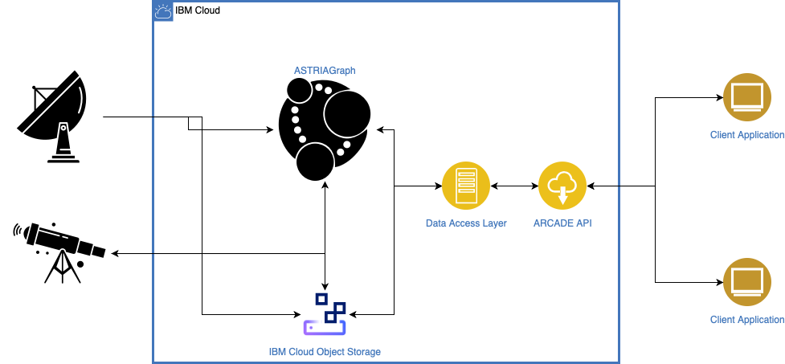

# ARCADE

The Advanced Research Collaboration and Application Development Environment (ARCADE) is a collaboration project between the [ASTRIA Research Group](https://sites.utexas.edu/moriba/) at the University of Texas at Austin, the IBM Space Tech team, and other partners. The goal of this repository is to provide a unified and coherent API for accessing, analyzing, and extending a diverse set of derived data points concerning an anthropogenic space object (ASO). Note: this repository currently represents a small proof of concept and is in a very alpha state of development, so APIs (internal and external) may change greatly.

## Architecture

 The ARCADE platform ingests data from multiple raw and preprocessed sources including telescopes, radar arrays, and TLE data from different providers and fuses it into a coherent view of each ASO. This data fusion is done in [ASTRIAGraph](https://sites.utexas.edu/moriba/astriagraph/) with the data being stored in the graph database or IBM's [cloud object storage (COS)](https://www.ibm.com/products/cloud-object-storage) depending on the data type. A RESTful API is then used to provide access to this rich data to developers and client applications.

## API

Interactive documentation for the API where you can try it out in a web browser is available [here](https://arcade.spacetech-ibm.com/docs).  The currently provided endpoints that you can programmatically test via the base URI https://arcade.spacetech-ibm.com are:

| Endpoint     | Description                                                                                                                                             |
|------------ |------------------------------------------------------------------------------------------------------------------------------------------------------- |
| /asos        | Returns basic information on all the ASOs that ARCADE knows about like its name and various identifiers                                                 |
| /aso         | Returns the basic information for a single ASO                                                                                                          |
| /ephemeris   | Provides the most up-to-date ephemeris data for an ASO                                                                                                  |
| /interpolate | Uses UT's [`orbdetpy` library](https://github.com/ut-astria/orbdetpy) to interpolate the ephemeris data for the ASO to the specified temporal frequency |

## Demo Client Applications

### Conjunction Search

The [conjunction search demo](https://spaceorbits.net) of the [space situational awareness](https://github.com/ibm/spacetech-ssa) project now uses the ARCADE demo API mentioned above to gather the up-to-date ephemeris data and then determine the nearest conjunctions of each satellite.

### Observatory Light Pollution (Coming Soon)

[Daniel Kucharski](https://www.oden.utexas.edu/people/1610/) of the University of Texas has developed a [C++ library](https://github.com/danielkucharski/SatLightPollution) for determining how much light pollution a terrestrial based astronomical observatory will experience over a given time period due to ASOs passing overhead. We would like to develop a UI that utilizes this library and the ARCADE API to allow astronomers to plan their observations for time windows that will be the least impacted by ASOs.

## Development

This PoC is developed using Python 3.8 with the [FastAPI](https://fastapi.tiangolo.com) framework and [docker](https://www.docker.com) is used develop, test, and deploy the application. A makefile is provided to run most of the common development tasks like:

| Command           | Description                                                                     |
|----------------- |------------------------------------------------------------------------------- |
| `make build`      | Builds a docker image                                                           |
| `make clean`      | Removes all built docker images                                                 |
| `make type_check` | Uses [mypy](https://mypy.readthedocs.io/en/stable/) to type check the code base |
| `make test`       | Runs the test suite                                                             |
| `make run`        | Runs the API locally at <http://localhost:8000>                                 |

See the [makefile](file:///Users/colin/projects/arcade/Makefile) for other useful commands as well.

## Contributing

We very much encourage anyone and everyone to join and contribute to this project. Please see the [contributing file](file:///Users/colin/projects/arcade/CONTRIBUTING.md) for more details.

## License

ARCADE is licensed under the Apache 2.0 license. Full license text is available at [LICENSE](file:///Users/colin/projects/arcade/LICENSE).
